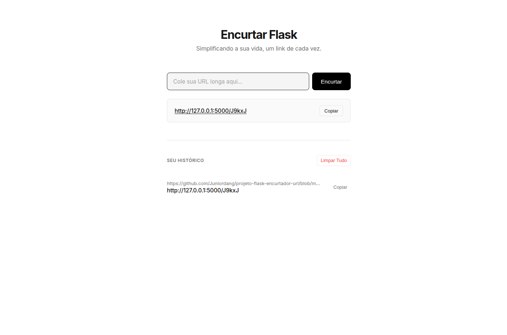

# Encurtador de URLs com Flask

O **Encurtador de URLs com Flask** é uma aplicação web moderna desenvolvida com Flask que permite transformar links longos e complexos em URLs curtas e amigáveis. O projeto foca em uma interface intuitiva, performance e persistência de dados.

---

## 🎯 Objetivo do Projeto

Este projeto foi desenvolvido com fins acadêmicos para aplicar conceitos fundamentais de desenvolvimento web com Python, incluindo:

- **Rotas Dinâmicas:** Criação de endpoints inteligentes com Flask para redirecionamento.
- **Persistência de Dados:** Uso do SQLAlchemy para gerenciar um banco de dados SQLite local.
- **UX/UI Moderno:** Interface responsiva com foco em experiência do usuário (Dark Mode).
- **Isolamento de Ambiente:** Gerenciamento de dependências via `venv` para garantir a portabilidade.

---

## 🛠️ Tecnologias Utilizadas

| Categoria          | Tecnologia                      |
| :----------------- | :------------------------------ |
| **Linguagem**      | Python 3.12+                    |
| **Framework Web**  | Flask                           |
| **Banco de Dados** | SQLite (via Flask-SQLAlchemy)   |
| **Estilização**    | HTML5, CSS3 (Custom Dark Theme) |
| **Ambiente**       | Venv (Virtual Environment)      |

---

## ⚙️ Como Executar o Projeto (Linux/Ubuntu)

Siga os passos abaixo para clonar e rodar o encurtador na sua máquina local de forma segura e isolada.

### 1. Instalar dependências do sistema

Certifique-se de que o suporte ao ambiente virtual do Python está instalado no seu sistema operacional:

```bash
sudo apt update
sudo apt install python3.12-venv


# Clonar o projeto
git clone [https://github.com/SEU_USUARIO/NOME_DO_REPOSITORIO.git](https://github.com/SEU_USUARIO/NOME_DO_REPOSITORIO.git)
cd NOME_DO_REPOSITORIO

# Criar o ambiente virtual (venv)
python3 -m venv venv
source venv/bin/activate

# Instalar dependências dentro da venv para evitar conflitos globais
./venv/bin/python3 -m pip install -r requirements.txt

#Rode o projeto
./venv/bin/python3 app.py


```

## Imagem do Projeto


